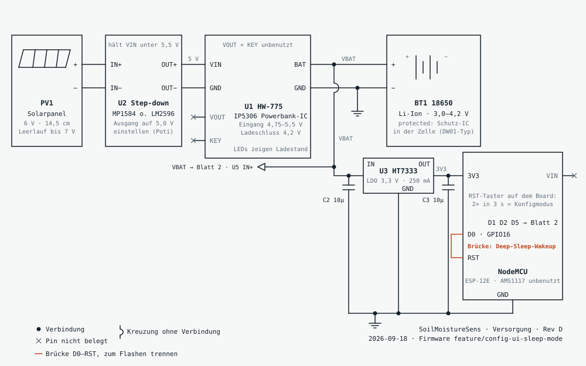
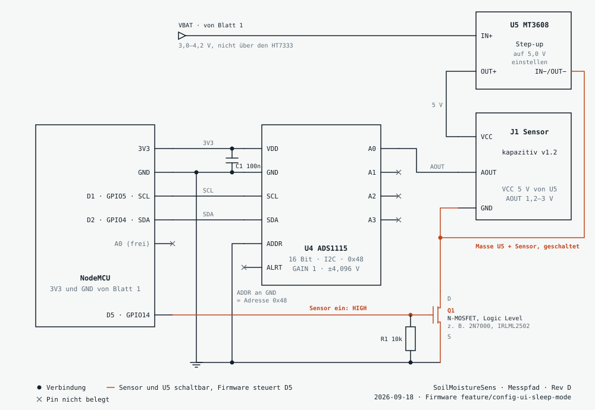

# SoilMoistureSens

Batteriebetriebener Bodenfeuchtesensor auf NodeMCU (ESP8266) mit Solarladung.
Misst alle 15 Minuten, sendet per MQTT und schläft dazwischen im Deep Sleep.
Einstellungen laufen über eine Web-Oberfläche auf dem Chip.

## Hardware

- NodeMCU (ESP-12E), versorgt über den **3V3-Pin**, VIN bleibt frei
- ADS1115 am I2C: SDA GPIO4 (D2), SCL GPIO5 (D1), ADDR an GND (Adresse 0x48),
  Sensorausgang an A0 des ADS1115. Der interne A0 des ESP bleibt frei.
- Kapazitiver Feuchtesensor v1.2 an **5 V**. Auf vielen dieser Sensoren sitzt
  ein NE555, der an 3,3 V kaum zwischen nass und trocken unterscheidet. Die
  5 V kommen aus einem MT3608-Step-up, der direkt am Akku hängt, nicht an den
  geregelten 3,3 V.
- Sensorversorgung geschaltet: GPIO14 (D5) treibt das Gate eines
  Logic-Level-N-MOSFET (z. B. 2N7000, besser IRLML2502), 10 kΩ vom Gate nach
  GND. Im Drain liegen die Masse des Sensors **und** die Masse des MT3608.
  Ein Step-up reicht auch im Ruhezustand die Eingangsspannung durch, darum
  wird er mit abgeschaltet.
- 6-V-Solarpanel 14,5 cm, davor ein Step-down auf 5,0 V (MP1584 oder
  LM2596), dann das HW-775-Lademodul (IP5306, VIN verträgt nur 4,75 bis
  5,5 V). 18650-Akku **mit Schutzschaltung** (protected, das BAT-Pad hängt
  ungeschützt an der Zelle).
- HT7333 vom BAT-Pad auf den 3V3-Pin, je 10 µF an Ein- und Ausgang. VOUT des
  HW-775 bleibt frei, der 5-V-Ausgang schaltet im Deep Sleep nach 32 s ab.
- **Brücke D0 (GPIO16) an RST**: ohne sie wacht der Chip nicht aus dem Deep Sleep auf
- Kein zusätzlicher Taster: der Reset-Taster des NodeMCU, zweimal innerhalb
  von 3 s gedrückt, öffnet den Konfigmodus
- Gehäuse unter `case/`

### Schaltplan

Rev D, Stand 2026-09-18. Quelle mit Verdrahtungstabellen und Hinweisen:
[`docs/hardware/schaltplan.html`](docs/hardware/schaltplan.html).

**Blatt 1, Versorgung**



**Blatt 2, Messpfad**



Vor dem ersten Einschalten: Step-down ohne Last auf 5,0 V einstellen,
MT3608 ohne Sensor auf 5,0 V einstellen (der Trimmer reagiert oft erst nach
15 bis 25 Umdrehungen), HT7333-Ausgang auf 3,3 V prüfen. Den Sensorausgang
einmal in trockener Luft messen: der ADS1115 verträgt an 3,3 V Versorgung
höchstens 3,6 V am Eingang, typisch liefert der Sensor bis 3,0 V.

### Stückliste

| Ref | Teil | Typ / Wert | Hinweis |
|---|---|---|---|
| PV1 | Solarpanel | 6 V, 14,5 cm | Leerlauf bis 7 V |
| U2 | Step-down-Modul | MP1584EN, alternativ LM2596 | auf 5,0 V eingestellt |
| U1 | Lademodul HW-775 | IP5306 | nur VIN, GND und BAT benutzt |
| BT1 | 18650 Li-Ion mit Halter | protected, 3,0 bis 4,2 V | etwa 3 mm länger als eine nackte Zelle |
| U3 | LDO HT7333-A | 3,3 V, 250 mA | TO-92 von vorn: GND, VIN, VOUT |
| C2, C3 | Kondensator | 10 µF | C3 gern größer, bis 100 µF |
| A1 | NodeMCU | ESP-12E (ESP8266) | Versorgung über den 3V3-Pin |
| U4 | ADS1115-Modul | 16 Bit, I2C 0x48 | ADDR an GND |
| C1 | Kondensator | 100 nF | direkt am ADS1115 |
| U5 | Step-up-Modul MT3608 | auf 5,0 V eingestellt | versorgt nur den Sensor |
| J1 | Bodenfeuchtesensor | kapazitiv v1.2 | mit NE555, braucht 5 V |
| Q1 | N-MOSFET, Logic Level | 2N7000, besser IRLML2502 | schaltet Masse von U5 und J1 |
| R1 | Widerstand | 10 kΩ | Gate von Q1 nach GND |
| JP1 | Drahtbrücke | D0 nach RST | zum Flashen abziehen |

## Flashen

```bash
pio run -e esp12e -t upload
pio device monitor
```

Startet der Upload nicht, die Brücke GPIO16 zu RST für den Upload trennen.

## Bedienung

**Konfigmodus** startet beim ersten Einschalten (ohne Konfiguration) oder nach
zweimaligem Druck auf den Reset-Taster innerhalb von 3 s. Ein einzelner Druck
löst nur einen normalen Messzyklus aus.

1. Mit WLAN `SoilMoisture-Setup` verbinden, Passwort `bodenfeuchte`.
2. `http://192.168.4.1/` öffnen.
3. WLAN, MQTT-Broker, Kalibrierung und Intervall eintragen.
4. "Speichern und Messbetrieb starten".

Sobald das Heimnetz eingetragen ist, ist die Seite auch über die dort
vergebene IP erreichbar (steht im seriellen Monitor und in der WLAN-Karte).

Kalibrieren: Sensor an der Luft halten und bei "trocken" den aktuellen Wert
übernehmen, dann ins Wasserglas und bei "nass" übernehmen. Die Rohwerte des
ADS1115 liegen bei etwa 9600 bis 24000 (0,125 mV pro Schritt). Rohwert -1
heißt: der ADS1115 antwortet nicht, dann Verdrahtung und Adresse prüfen.

Statische IP: Wer eine feste Adresse einträgt, spart beim Aufwachen die
DHCP-Zeit. Gateway und Subnetzmaske sind dann Pflicht, DNS ist optional
(leer = Gateway). Feld leer lassen bedeutet DHCP.

Der Konfigmodus endet nach 5 Minuten ohne Bedienung von selbst.

**Messbetrieb**: aufwachen, Sensor und Step-up einschalten, messen, beides aus, senden,
schlafen. Ziel unter 10 Sekunden wach. Ohne WLAN oder Broker schläft der Sensor trotzdem bis zum nächsten
Intervall, damit der Akku geschont wird.

## MQTT

Topic `<Präfix>/<Gerätename>/state`, retained:

```json
{"raw":202,"percent":54,"level":"ok","rssi":-61}
```

`level` ist `dry`, `ok` oder `wet` nach den eingestellten Schwellen.

## Entwicklung

```bash
pio test -e native      # Logik-Tests auf dem PC (braucht g++)
pio run -e esp12e       # Firmware bauen
```

Konfiguration liegt in `/config.json` im LittleFS des Chips. Zum Zurücksetzen
`pio run -e esp12e -t erase` und neu flashen.

Design-Spec: `docs/superpowers/specs/2026-09-12-config-ui-and-sleep-mode-design.md`
Schaltplan: `docs/hardware/` (HTML-Quelle und die beiden SVG-Blätter)
Mockup der Oberfläche: `docs/design/Main.dc.html`
